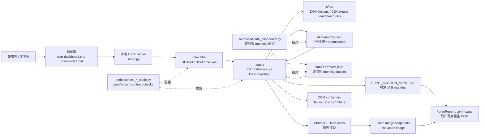
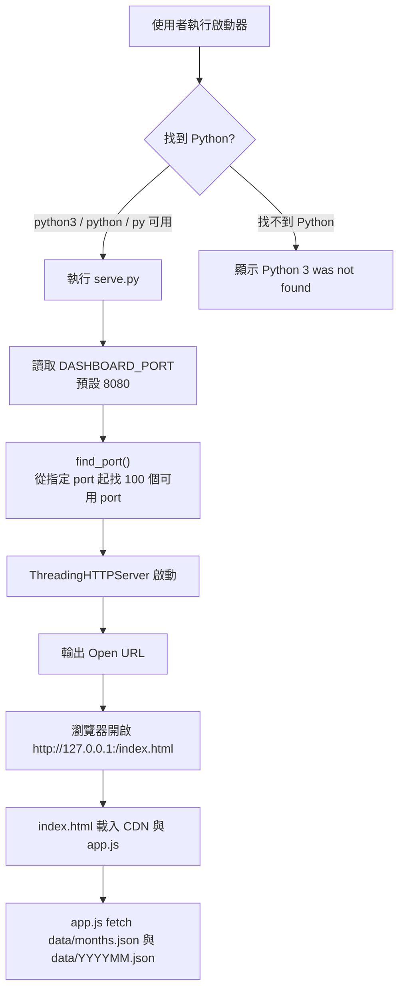
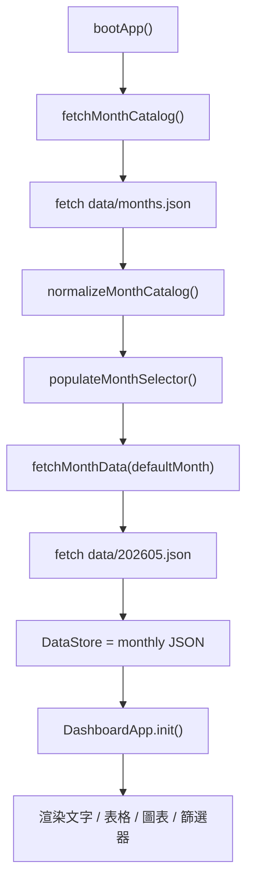
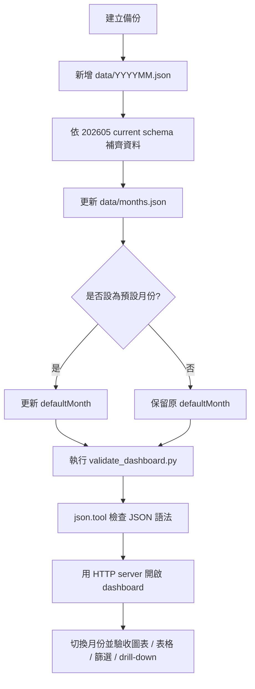
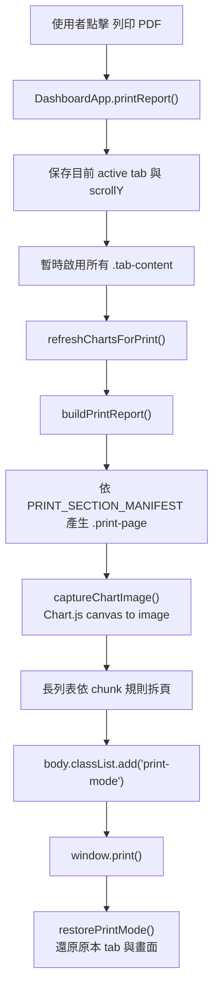
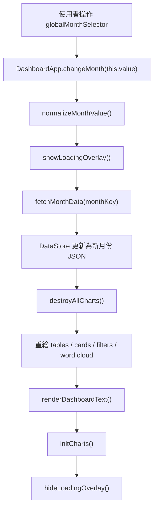

# Dashboard Project 系統全景地圖導航

本文件是 `/Users/chanwaitung2025/Downloads/dashboard-project` 的系統全景導航與技術白皮書。目標是讓未來的自己、工程師或 Codex 接手時，可以快速理解這個可攜式旅遊業務分析儀表板的架構、資料流、模組邊界、維護規則與後續優化方向。

> 核心原則：這是一個以本地 HTTP server 驅動的靜態前端 dashboard。正式驗收不可用 `file://`，必須使用 `http://127.0.0.1:<port>/index.html`。

更新日期：2026-07-03

---

## 1. 專案定位與使用場景

此專案是一個可攜式旅遊業務分析儀表板，用於展示旅行團問卷、推薦意願、領隊表現、出團記錄、出團長評、門市服務意見與綜合洞察。

它的定位不是完整後端系統，而是「可整包搬移、可本地啟動、可用 JSON 月份資料更新」的前端 BI 展示工具。

主要使用場景：

- 旅行團問卷與滿意度結果展示
- 月份資料切換與比較
- 領隊、目的地、門市服務回饋檢視
- 本地 demo、業務匯報、作品集展示
- 後續每月新增 `data/YYYYMM.json` 後快速驗收

目前已工程化的月份資料：

| 月份 | 檔案 | schema | 狀態 | 用途 |
|---|---|---|---|---|
| 2026 年 05 月 | `data/202605.json` | `current` | `ready` | current schema 標準參考 |
| 2026 年 04 月 | `data/202604.json` | `legacy` | `ready` | 歷史資料，可缺少部分 current 欄位 |

---

## 2. 系統全景架構

系統由五層組成：

1. 啟動層：`start-dashboard.sh`、`start-dashboard.command`、`start-dashboard.bat`
2. 本地服務層：`serve.py`
3. UI Shell：`index.html`
4. 前端應用層：`app.js` + `js/*.js`
5. 資料與治理層：`data/months.json`、`data/YYYYMM.json`、`scripts/validate_dashboard.py`
6. PDF / print 層：`PRINT_SECTION_MANIFEST`、`#printReport`、`.print-page`



### 模組責任邊界

| 模組 | 主要責任 | 不應承擔的責任 |
|---|---|---|
| `serve.py` | 啟動本地 HTTP server、提供 no-store cache header、自動尋找可用 port | 不處理資料轉換、不處理 dashboard rendering |
| `index.html` | 定義 UI 結構、分頁、canvas、容器、樣式與 CDN 依賴 | 不放月份資料、不放 Chart.js 業務邏輯 |
| `app.js` | ES module 入口；載入 manifest 和月份 JSON、渲染文字/表格/圖表、處理互動、drill-down 與 PDF report builder | 不改寫原始 JSON schema、不把資料存回檔案 |
| `js/*.js` | 放置低耦合工具模組，例如 DOM helper、CSV 匯出、tour days 與 Chart 清理 | 不放月份資料、不改變 dashboard 對外 DOM 契約 |
| `PRINT_SECTION_MANIFEST` | 明確定義 PDF 匯出時每個 tab 如何分頁與 chunk 長列表 | 不承擔資料治理、不替代 dashboard 一般畫面 |
| `#printReport` | PDF/print 專用 DOM 容器；只在 `body.print-mode` 顯示 | 不應在一般 dashboard 模式中顯示 |
| `data/months.json` | 管理可用月份、預設月份、schema 類型與狀態 | 不放圖表 formatter、不放互動邏輯 |
| `data/YYYYMM.json` | 存放每月 dashboard 純資料 | 不放 `function`、`formatter`、`onClick`、`=>`、Chart.js config |
| `scripts/validate_dashboard.py` | 檢查 manifest、monthly JSON、禁用 token、schema 必要欄位與基本資料形狀 | 不啟動 dashboard、不做瀏覽器驗收 |
| `scripts/check_print_report_static.py` | 檢查 PDF/print layout 的靜態契約 | 不取代瀏覽器列印驗收 |
| `scripts/check_screen_layout_static.py` | 檢查一般畫面不被 print layout 污染 | 不取代人工 UI 檢查 |

---

## 3. 技術棧總覽

### Runtime 與服務

- Python 3：本地 HTTP server 與驗證腳本
- `http.server.ThreadingHTTPServer`：提供本地靜態檔案服務
- `SimpleHTTPRequestHandler`：加上 `Cache-Control: no-store`
- Shell / Batch 啟動器：降低不同作業系統的啟動摩擦

### 前端

- HTML5：dashboard 結構與 canvas 容器
- Vanilla JavaScript ES modules：資料載入、狀態管理、DOM 更新、互動邏輯與工具模組
- Chart.js `4.4.1`：主要圖表引擎
- `chartjs-plugin-datalabels` `2.2.0`：圖表資料標籤
- Tailwind CDN：utility class 與快速 UI layout
- Font Awesome `6.4.0`：icon
- Google Fonts：字體載入

### 資料格式

- JSON manifest：`data/months.json`
- JSON monthly dataset：`data/202604.json`、`data/202605.json`
- CSV export：由 `app.js` 在瀏覽器端產生，包含 BOM 與 DDE injection 防護

### 目前仍依賴 CDN 的資源

`index.html` 目前仍從 CDN 載入：

- Tailwind CSS
- Chart.js
- ChartDataLabels
- Font Awesome
- Google Fonts

因此，現階段不是完全離線版。若要斷網使用，需要先做 CDN assets 本地化。

---

## 4. 啟動與 HTTP serving 流程

正式開啟方式：

```sh
./start-dashboard.sh
```

或直接：

```sh
python3 serve.py
```

Windows 可使用：

```bat
start-dashboard.bat
```

啟動流程：



### 為什麼不能用 `file://`

`app.js` 會使用：

```js
fetch('./data/months.json')
fetch('./data/YYYYMM.json')
```

如果直接雙擊 `index.html` 用 `file://` 開啟，瀏覽器可能因本地檔案安全限制阻止 `fetch()`，造成：

- `failed to fetch`
- dashboard 白屏
- 月份資料無法切換
- 圖表無法初始化

所以正式驗收必須使用 HTTP URL，例如：

```text
http://127.0.0.1:8080/index.html
```

---

## 5. 月份資料工程化流程

月份資料採用 manifest-driven 設計：

- `data/months.json` 管理月份清單與預設月份
- `app.js` 先讀 manifest，再載入指定月份 JSON
- 新增月份時，不需要手動修改 `index.html` 的月份 option



目前 manifest：

```json
{
  "defaultMonth": "202605",
  "months": [
    {
      "key": "202605",
      "label": "2026年 05月",
      "schema": "current",
      "status": "ready"
    },
    {
      "key": "202604",
      "label": "2026年 04月",
      "schema": "legacy",
      "status": "ready"
    }
  ]
}
```

### 新增月份 SOP



---

## 6. 前端渲染與互動規則

`app.js` 是目前唯一的前端應用入口。它以 ES module 載入 `js/` 內的低耦合工具模組，仍使用 IIFE 建立 `DashboardApp`，並將其掛到 `window.DashboardApp`，供 `index.html` 的 inline event handler 呼叫。

### 啟動核心流程

```text
DOMContentLoaded
  -> bootApp()
  -> fetchMonthCatalog()
  -> fetchMonthData()
  -> Chart.register(ChartDataLabels)
  -> DashboardApp.init()
```

`DashboardApp.init()` 目前負責：

- `renderDashboardText()`
- `renderLeadersTable()`
- `renderTourDetailsTable()`
- `renderBranchLeaderboard()`
- `renderBranchFeedbacks()`
- `renderFeedbackFilters()`
- `renderWordCloud()`
- `filterFeedback()`
- `initCharts()`
- `setupEventListeners()`

### PDF 匯出流程

PDF 匯出走專用 print pipeline，不直接列印一般互動畫面。入口是 `DashboardApp.printReport()`。



目前 PDF 分頁規則集中在 `app.js` 的 `PRINT_SECTION_MANIFEST`：

- `dashboard`：KPI / profile / satisfaction / channel insights 分頁。
- `sales_forecast`：銷售預測與 association rules 分頁。
- `nps_zone`：driver analysis、future trends、opinion mining 分頁。
- `records`：摘要、目的地/旅程分布、交叉分析、出團明細 table chunk。
- `feedback_analysis`：長評卡片以 `#feedbackGrid` 每 3 張拆頁。
- `branch_feedback`：門市排行榜與門市長評分別 chunk。
- `analysis`：綜合策略摘要分頁。

若 PDF 仍有壓扁、空白過多或圖表未顯示，優先調整 `PRINT_SECTION_MANIFEST`、print CSS、chart snapshot 尺寸，不要把 PDF 特例塞進 JSON。

### 月份切換資料流



### 主要互動

| 互動 | 入口 | 行為 |
|---|---|---|
| 月份切換 | `globalMonthSelector` | 重新 fetch 月份 JSON、銷毀舊 Chart、重繪 dashboard |
| 分頁切換 | `DashboardApp.switchTab()` | 切換 `.tab-content.active` 與 tab button 狀態 |
| Top 5 目的地 drill-down | `topDestChart` `onClick` | 呼叫 `filterSatChart()` 篩選交叉滿意度圖 |
| drill-down 重置 | `resetBtn` | 呼叫 `resetDrillDown()` 還原完整交叉圖 |
| 出團長評篩選 | `destFilter`、`typeFilter`、`leaderFilter` | 重新渲染 `feedbackGrid` 與情緒佔比 |
| CSV 匯出 | `exportLeadersCSV()` 等 | 瀏覽器端產生 CSV，避免 Excel DDE injection |

### UI 修改必須保留的 DOM 契約

如果後續修改 UI 或回套 Stitch 設計，必須保留以下 id，不可改名或刪除：

- 月份選擇器：`globalMonthSelector`
- 分頁 id：`dashboard`、`sales_forecast`、`nps_zone`、`tourleader`、`records`、`feedback_analysis`、`branch_feedback`、`analysis`
- canvas id：`genderChart`、`ageChart`、`memberConsentCrossChart`、`satisfactionChart`、`destAgeCrossChart`、`sourceChart`、`channelChart`、`salesForecastChart`、`rfmChart`、`satisfactionCrossChart`、`npsCorrelationChart`、`topDestChart`、`durationDistChart`、`futureDestChart`、`npsDistChart`、`npsScoreChart`
- 動態容器 id：`fullLeadersTable`、`tourDetailBody`、`wordCloudContainer`、`feedbackGrid`、`branchLeaderboard`、`branchFeedbackGrid`、`sentimentStatusBar`
- print 容器 id：`printReport`
- 狀態容器 id：`js-error-boundary`、`loadingOverlay`

---

## 7. JSON schema 與資料治理規則

### 純資料原則

`data/*.json` 只能放純資料，不可以加入：

- `function`
- `formatter`
- `onClick`
- `=>`
- Chart.js 設定
- 動態配色
- drill-down 邏輯

以上邏輯全部留在 `app.js`。

這條規則的目的：

- 避免 JSON 變成半程式碼格式
- 降低 XSS 與資料來源污染風險
- 讓月更資料可以用標準 JSON parser 驗證
- 讓互動邏輯集中在 `app.js`，方便維護

### current schema

`202605.json` 是 current schema 參考。後續新增月份應盡量補齊同級欄位，包括：

- `genderData`
- `ageData`
- `memberConsentCrossData`
- `satisfactionDistributionData`
- `destAgeCrossData`
- `satisfactionCrossData`
- `branchLeaderboardData`
- `branchRawFeedbacks`
- `salesData`
- `customerSegments`
- `sourceData`
- `channelData`
- `rawFeedbacks`
- `uniqueTours`
- `leadersRaw`
- `futureDestData`
- `npsDistData`
- `npsScoreData`
- `npsCorrelationData`
- `topDestData`
- `durationDistData`
- `dashboardSummary`
- `dashboardTextLabels`
- `dashboardInsights`
- `futureTrendInsights`
- `opinionMiningInsights`
- `recordsSummary`
- `recordsInsights`
- `feedbackKeywordCloud`

### legacy schema

`202604.json` 是 legacy schema。它允許缺少部分 5 月後新增欄位，不需要為了補齊 current schema 而重建舊資料。

legacy schema 目前仍應保留核心欄位，例如：

- `satisfactionCrossData`
- `branchLeaderboardData`
- `branchRawFeedbacks`
- `sourceData`
- `channelData`
- `rawFeedbacks`
- `uniqueTours`
- `leadersRaw`
- `futureDestData`
- `npsDistData`
- `npsScoreData`
- `topDestData`
- `durationDistData`
- `dashboardSummary`
- `dashboardTextLabels`
- `dashboardInsights`
- `recordsSummary`
- `recordsInsights`

### 驗證器負責的治理

`scripts/validate_dashboard.py` 目前檢查：

- `data/months.json` 是否存在
- `defaultMonth` 是否符合 `YYYYMM`
- `months[]` 是否有合法 `key`、`label`、`schema`
- manifest 指向的 `data/YYYYMM.json` 是否存在
- 禁用 token：`function`、`formatter`、`onClick`、`=>`
- current schema required keys
- legacy schema optional missing warning
- chart-like data 的 `labels` / `values` 長度
- `rawFeedbacks[].type` 是否屬於 `positive`、`suggestion`、`negative`
- `uniqueTours[].days` 是否為 1 至 30 或 null
- `leadersRaw[].score`、`branchLeaderboardData[].score` 是否為數字
- `leadersRaw[].n`、`branchLeaderboardData[].n` 是否為非負整數

---

## 8. 驗證與驗收清單

### 每次修改後必跑

```sh
python3 scripts/validate_dashboard.py
python3 scripts/check_print_report_static.py
python3 scripts/check_screen_layout_static.py
python3 -m json.tool data/months.json >/dev/null
python3 -m json.tool data/202604.json >/dev/null
python3 -m json.tool data/202605.json >/dev/null
```

如有新增月份：

```sh
python3 -m json.tool data/YYYYMM.json >/dev/null
```

如本機有 Node.js：

```sh
node --check app.js
```

> 注意：如果目前環境找不到 `node`，不要宣稱 `node --check app.js` 已通過。應先確認 Node.js 版本與來源，再執行檢查。

### HTTP 資源驗收

啟動：

```sh
DASHBOARD_NO_BROWSER=1 python3 serve.py
```

確認以下路徑 HTTP 200：

- `/index.html`
- `/app.js`
- `/data/months.json`
- `/data/202604.json`
- `/data/202605.json`
- 新增月份時加上 `/data/YYYYMM.json`

### 瀏覽器功能驗收

在 `http://127.0.0.1:<port>/index.html` 檢查：

- 預設月份是否為 `202605`
- 月份下拉選單是否顯示 `2026年 05月` 與 `2026年 04月`
- 切換 `202604` 後文字、圖表、表格正常重繪
- 切回 `202605` 後 current schema 區塊正常顯示
- Top 5 目的地 drill-down 正常
- `resetBtn` 可還原滿意度交叉分析
- 出團長評目的地、類型、領隊篩選正常
- 門市排行榜與門市長評正常
- Console 沒有 `failed to fetch`、白屏或 Chart 重疊錯誤

### PDF / print 驗收

在 HTTP server 模式下檢查：

- 一般 dashboard 未進入 `body.print-mode`
- 一般 dashboard 中 `#printReport` 不可見
- 點擊「列印 PDF」後 `#printReport .print-page` 會生成
- 圖表在 PDF 中以圖片顯示，不是空白 canvas
- 圓環圖保持正圓比例
- 長評、門市意見、出團明細不被硬塞到同一頁
- 每個主要分頁在 PDF 中有清楚頁首與月份標記

若需要壓力測試，可建立暫時虛擬月份，例如 `data/209912.json`，用放大的長評、排行榜、門市意見與出團明細測試 PDF chunk 行為。測試完成後應從 `data/months.json` 移除虛擬月份。

---

## 9. 主要檔案導航

| 路徑 | 角色 | 接手時先看什麼 |
|---|---|---|
| `index.html` | UI Shell | CDN 依賴、tab id、canvas id、動態容器 id、inline handler |
| `app.js` | 前端應用核心 | ES module imports、`bootApp()`、`fetchMonthCatalog()`、`fetchMonthData()`、`DashboardApp.init()`、`initCharts()` |
| `app.js` PDF 區塊 | 列印報告核心 | `PRINT_SECTION_MANIFEST`、`buildPrintReport()`、`captureChartImage()`、`DashboardApp.printReport()` |
| `js/dom-utils.js` | DOM 與字串安全 helper | `escapeHTML()`、loading/error overlay、`setHTML()`、`setText()`、fallback helpers |
| `js/csv-export.js` | CSV 匯出 helper | BOM、Excel formula-injection 防護、下載流程 |
| `js/dashboard-utils.js` | Dashboard 通用 helper | `getValidTourDays()`、`destroyAllCharts()` |
| `data/months.json` | 月份 manifest | `defaultMonth`、`months[]`、schema、status |
| `data/202605.json` | current schema 月份資料 | 後續新增月份的欄位參考 |
| `data/202604.json` | legacy schema 月份資料 | 舊資料兼容狀態 |
| `scripts/validate_dashboard.py` | 資料驗證 CLI | required keys、禁用 token、資料形狀檢查 |
| `scripts/check_print_report_static.py` | PDF 靜態契約檢查 | `#printReport`、`.print-page`、chart snapshot helper 是否存在 |
| `scripts/check_screen_layout_static.py` | 一般畫面隔離檢查 | normal screen guard、print report hidden outside print mode |
| `MONTHLY_DATA_IMPORT.md` | 月更 SOP | 新增月份與驗收流程 |
| `serve.py` | 本地 HTTP server | port 搜尋、no-store header、啟動 URL |
| `start-dashboard.sh` | macOS / Unix 啟動器 | python3 / python fallback |
| `start-dashboard.command` | macOS 雙擊入口 | 權限與 Terminal 開啟體驗 |
| `start-dashboard.bat` | Windows 啟動器 | py / python / python3 fallback |
| `DASHBOARD_PROJECT_HANDOFF.md` | 跨對話交接 | 專案邊界、月資料工程化狀態、與 `nbs_analytics` 分工 |
| `ui-ux-export/` | Stitch UI 交接包 | 只作設計參考，不應直接覆蓋正式 dashboard |
| `backups/` | 歷史備份 | 回溯 UI / month engineering 前版本 |

---

## 10. 後續可優化方向

### P0：保持現有月更穩定性

- 新增月份時永遠先備份
- 使用 `202605.json` 作為 current schema 參考
- 修改資料後先跑 `validate_dashboard.py`
- 用 HTTP server 驗收，不使用 `file://`

### P1：完全離線化 CDN assets

目前 dashboard 仍依賴外部 CDN。若要做真正可攜與離線展示，應：

- 將 Tailwind、Chart.js、ChartDataLabels、Font Awesome、Google Fonts 轉為本地 assets
- 更新 `index.html` 的 script / stylesheet 路徑
- 補充 `serve.py` MIME mapping 檢查
- 斷網驗收圖表、字體、icon 與樣式

### P2：`app.js` 模組拆分

目前 `app.js` 集中處理資料載入、渲染、互動、圖表與匯出。後續可在不改變 runtime 行為的前提下拆分：

- data loading：manifest / monthly JSON
- render helpers：text、tables、cards
- chart builders：各 Chart.js config
- interactions：tab、filter、drill-down
- export：CSV 匯出

拆分前應先建立行為驗收清單，避免圖表 id 或 inline event handler 斷裂。

### P3：JSON schema 文件化或自動生成

可將 current / legacy schema 從 `validate_dashboard.py` 整理成更正式的 schema 文件：

- 欄位說明
- 型別
- 必填或可選
- 對應 dashboard 區塊
- 新月份填寫範例

進一步可考慮用 JSON Schema 驗證，但要避免引入過重工具鏈。

### P4：瀏覽器自動化驗收

目前驗收以人工瀏覽器檢查為主。後續可加入 Playwright 或類似工具：

- 啟動 HTTP server
- 開啟 `index.html`
- 等待 Chart.js canvas 初始化
- 切換 `202604` / `202605`
- 檢查 console error
- 截圖保存作為驗收證據
- 點擊「列印 PDF」後檢查 `.print-page` 數量與 chart image 數量
- 產出 PDF 並抽樣檢查首頁、Future Trends、長評、門市、綜合意見頁

### P5：UI 響應式與可讀性優化

Stitch UI 已有視覺回套痕跡，後續優化應優先處理：

- 手機與平板 tab 導航可用性
- 長文字不溢出
- 圖表容器不被壓縮
- icon 與標題間距一致
- 卡片邊界與層次清楚
- 表格橫向滾動與 sticky header 體驗

### P6：資料匯入流程半自動化

目前月更仍需手動建立 JSON。後續可建立輔助腳本：

- 從標準 CSV / Excel 轉成 `data/YYYYMM.json`
- 自動補齊 current schema 骨架
- 自動更新 `data/months.json`
- 自動跑 validator
- 產出月更報告

這一項應在資料來源格式穩定後再做，避免過早把不穩定欄位固化。

### P7：PDF 虛擬資料壓力測試

為避免真實資料量剛好太少而看不出版面問題，後續可建立測試 fixture：

- 自動複製 `202605` current schema
- 放大 `rawFeedbacks`、`branchRawFeedbacks`、`leadersRaw`、`uniqueTours`
- 加入極長文字、長目的地名稱、更多 table rows
- 暫時注入 manifest 或在測試腳本中 mock fetch
- 生成 PDF 後檢查壓縮、空白、斷頁與 chart image

這應該作為測試資料，不應進入正式月份清單。

---

## 11. 接手者快速路線

### 如果你要新增月份

1. 看 `MONTHLY_DATA_IMPORT.md`
2. 複製 `202605.json` 的 schema 思路建立 `data/YYYYMM.json`
3. 更新 `data/months.json`
4. 跑 `python3 scripts/validate_dashboard.py`
5. 用 HTTP server 驗收月份切換與圖表重繪

### 如果你要修 dashboard 空白

1. 確認是否用 HTTP server 開啟
2. 檢查 `/data/months.json` 與 `/data/YYYYMM.json` 是否 HTTP 200
3. 看 console 是否有 `failed to fetch`
4. 跑 `python3 scripts/validate_dashboard.py`
5. 最後才排查 `app.js` rendering logic

### 如果你要改 UI

1. 先列出受影響 tab 與 DOM id
2. 保留所有 canvas id 與動態容器 id
3. 不直接覆蓋 `ui-ux-export/`
4. 改完用 HTTP server 逐 tab 驗收

### 如果你要改資料規則

1. 先改 `scripts/validate_dashboard.py`
2. 同步更新 `MONTHLY_DATA_IMPORT.md`
3. 再更新本文件
4. 不要把互動邏輯塞進 JSON

---

## 12. 專案邊界

本專案只處理 `dashboard-project`：

- 旅行團問卷 dashboard
- 月份 JSON 管理
- Chart.js 前端互動
- 本地 HTTP 可攜啟動
- 出團、領隊、推薦意願、門市服務分析

不要在本專案修改 `nbs_analytics`。如果需求涉及：

- NBS 收入分析
- Streamlit dashboard
- LightGBM / ARIMA / Prophet
- WAPE / MAPE 回測
- 淨收入口徑
- 週級或月級銷售預測模型

應切回 `/Users/chanwaitung2025/Downloads/nbs_analytics` 處理。
